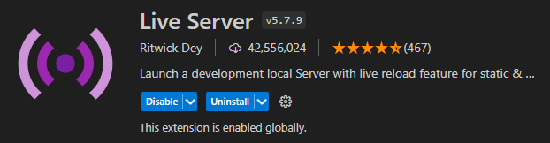

# HTML Layout Rolling

## Overview

HTML Layout Rolling is layout of [this](https://www.figma.com/file/1PgbKqg3EU1gok4HqWCgnv/NFT?node-id=40%3A133&mode=dev) design. Unfortunately I couldn't use original fonts because of the license on Rotunda fonts.

## Features

- **Easy to Customize:** Tailor the layout to fit your layout's unique requirements effortlessly.
- **Modular Components:** Use individual components or combine them to build complex layouts.
- **Cross-Browser Compatibility:** Tested and optimized for compatibility with popular web browsers.
- **Lightweight:** Keep your web pages fast and efficient with minimal impact on loading times.

## Getting Started

### Installation

1. Download the ZIP file with layout **or** use `git clone https://github.com/UeberTimei/html-layout-rolling`.
2. If you downloaded the ZIP file, then unarchive it.
3. Go to the folder with layout and write in console `npm install`.
4. Then write `gulp` in console. **Or** if you won't change any scss files use **Live Server** to run layout in the browser.
   

## License

This layout is licensed under the [MIT License](https://github.com/UeberTimei/html-layout-rolling/blob/main/LICENSE).
